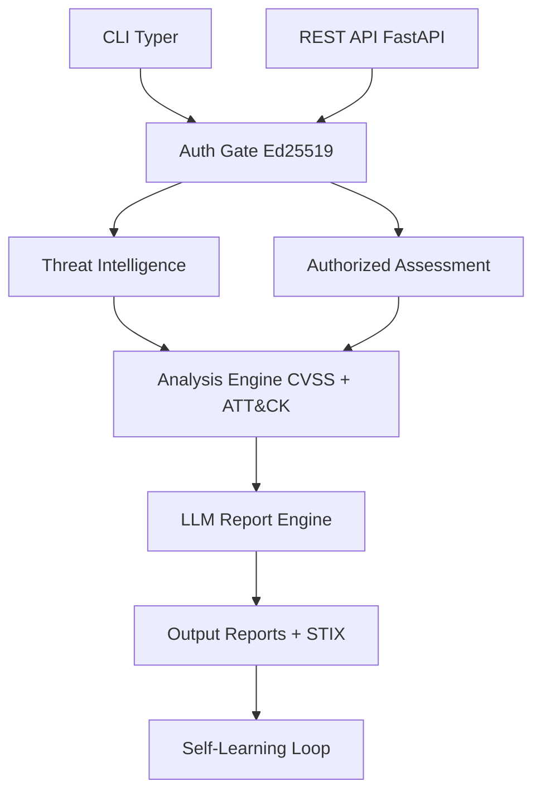

<p align="center">
  
  
  
  
</p>

<h1 align="center">🔒 grey-hat-security-agent</h1>

<p align="center">
  <strong>Authorized Cybersecurity Research & Red-Team Intelligence Agent</strong>
</p>

<p align="center">
  A permission-gated security assessment platform that combines continuous self-learning<br>
  with structured vulnerability assessment, CVSS v3.1 scoring, and MITRE ATT&CK mapping.<br>
  Every active scan requires a cryptographically-signed authorization token.
</p>

---

## Overview

**Two Operating Modes:**

1. **Threat Intelligence Mode** — Passively aggregate, score, and report malicious infrastructure (PhishTank, OpenPhish, URLhaus, VirusTotal, Shodan, NVD)
2. **Authorized Assessment Mode** — Perform structured penetration testing **only** against systems with explicit written authorization

> **⚠️ Ethics Boundary**: No code path exists for sending attack traffic without explicit user command + valid auth token.

---

## ✨ Features

### Core Security
- **Ed25519 Authorization Gate** — Mandatory signed token for every scan
- **CVSS v3.1 Calculator** — Full spec-compliant with NIST test vectors
- **MITRE ATT&CK Mapping** — Automatic CWE → TTP mapping
- **AES-256-GCM Encryption** — Application-level encryption for sensitive data

### Threat Intelligence
- 6+ threat feeds (PhishTank, OpenPhish, URLhaus, VirusTotal, Shodan, NVD)
- Composite Risk Scoring with NLP (SecRoBERTa)
- Weekly self-learning from ArXiv, NVD, Exploit-DB, MITRE

### Scanning & Analysis
- Integrated scanners: nmap, OWASP ZAP, nuclei, sslyze
- CodeBERT vulnerability detection
- Local CVE mirror + Docker sandbox

### Reporting
- Multi-format reports (Markdown, PDF, HTML)
- LLM-powered report engine (Claude → GPT-4o → Mistral)
- Responsible disclosure templates

---

## 🏗️ Architecture



---

## 🚀 Quick Start

### Prerequisites
- Python 3.11+
- nmap
- Docker (recommended)

### Installation

**Windows (PowerShell):**
```powershell
git clone https://github.com/dungnotnull/grey-hat-security-agent.git
cd grey-hat-security-agent
.\setup.ps1
Copy-Item .env.example .env
# Edit .env with your API keys
```

**Linux / macOS:**
```bash
git clone https://github.com/dungnotnull/grey-hat-security-agent.git
cd grey-hat-security-agent

python3 -m venv venv
source venv/bin/activate
pip install -r requirements.txt

cp .env.example .env
# Edit .env
```

---

## CLI Reference

```bash
# Threat Intelligence
python main.py intel score <domain>
python main.py intel check <domain>

# Authorization
python main.py authorize keygen
python main.py authorize create --target example.com --scope "port_scan,ssl_tls_check"
python main.py authorize sign --token-file token.json

# Scanning
python main.py scan run --target example.com --token-file signed-token.json
python main.py scan dry-run --target example.com

# Reports & Others
python main.py report generate --scan-id <id> --format pdf
python main.py update --source all
```

---

## API Reference

| Method | Endpoint                    | Description                        |
|--------|-----------------------------|------------------------------------|
| POST   | `/api/v1/auth/token`        | Create authorization token         |
| POST   | `/api/v1/auth/sign`         | Sign token                         |
| POST   | `/api/v1/intel/score`       | Score domain risk                  |
| POST   | `/api/v1/scan`              | Start authorized scan              |
| POST   | `/api/v1/report/generate`   | Generate report                    |
| POST   | `/api/v1/analysis/cvss`     | Calculate CVSS v3.1                |
| GET    | `/health`                   | Health check                       |

Interactive docs: `/docs`

---

## Authorization System

Every active scan requires a cryptographically signed token:

```json
{
  "version": "1.0",
  "token_id": "uuid-v4",
  "target": { ... },
  "scope": ["port_scan", "ssl_tls_check"],
  "expiry_unix": 1751241600,
  "signature": { ... }
}
```

---

## Project Structure

```bash
grey-hat-security-agent/
├── core/
│   ├── auth/           # Ed25519 authorization
│   ├── intel/          # Threat intelligence
│   ├── scanner/        # nmap, ZAP, nuclei...
│   ├── analysis/       # CVSS, MITRE, CodeBERT
│   ├── reporting/      # Report generation
│   └── knowledge/      # Self-learning
├── api/                # FastAPI endpoints
├── cli/                # Typer commands
├── db/                 # SQLAlchemy + encryption
├── models/             # ML models
├── tests/              # 87 passing tests
├── data/               # CVE mirror, reports
├── docker-compose.yml
├── setup.ps1
└── .env.example
```

---

## 🛠️ Tech Stack

| Component       | Technology                          |
|-----------------|-------------------------------------|
| Language        | Python 3.11+                        |
| API             | FastAPI                             |
| CLI             | Typer + Rich                        |
| Database        | SQLite + SQLAlchemy                 |
| Encryption      | cryptography (AES-256-GCM, Ed25519) |
| LLM             | Claude / GPT-4o / Ollama Mistral    |
| Scanners        | nmap, OWASP ZAP, nuclei, sslyze     |
| ML              | HuggingFace Transformers            |

---

## Testing

```bash
python -m pytest tests/ -v
python -m pytest tests/ --cov=core --cov-report=term-missing
```

---

## Deployment

**Docker Compose (Recommended):**
```bash
docker-compose up -d
```

**Manual:**
```bash
uvicorn api.main:app --host 0.0.0.0 --port 8000
```

---

## Security Policy & License

- See [SECURITY.md](SECURITY.md) for responsible disclosure.
- Licensed under the [MIT License](LICENSE).

---

<p align="center">
  <strong>Authorized use only.</strong><br>
  Every active scan requires a signed authorization token.
</p>
